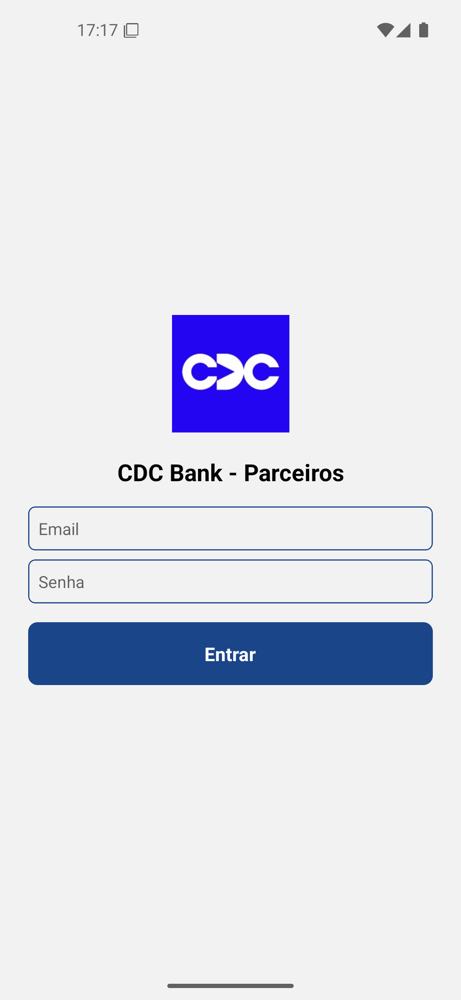
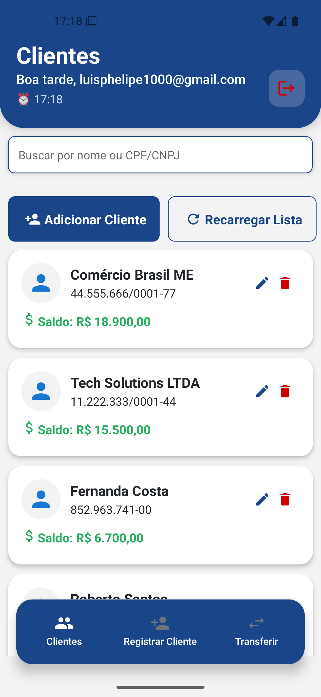
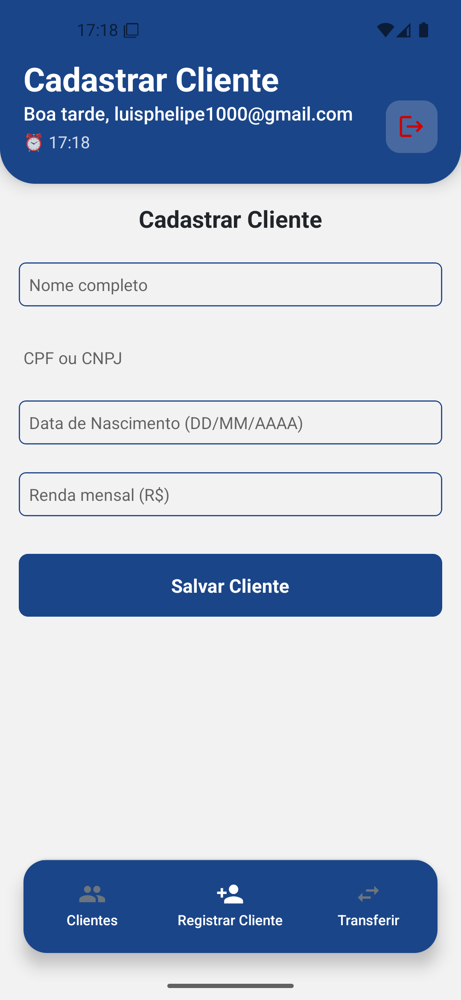
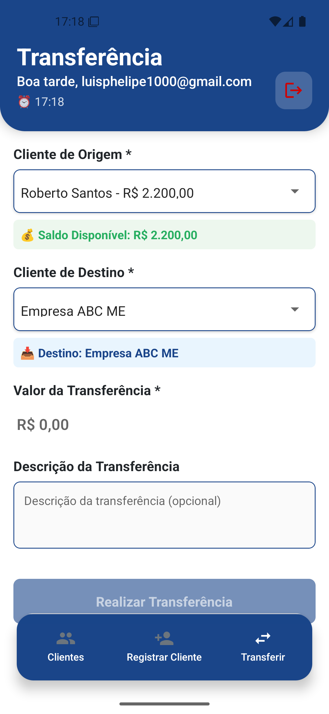

<div align="center">
  
  
  # 🏦 CDC Bank Mobile App
  
  <p>
    <strong>Aplicativo mobile desenvolvido em React Native + TypeScript para gerenciamento bancário , permitindo que parceiros gerenciem clientes e realizem transações entre contas de forma segura e eficiente</strong>
  </p>
  
  <p>
    
    
    
    
  </p>
  
  <p>
    <a href="#-features">Features</a> •
    <a href="#-screenshots">Screenshots</a> •
    <a href="#-tech-stack">Tech Stack</a> •
    <a href="#-getting-started">Getting Started</a> •
    <a href="#-license">License</a>
  </p>
</div>


## ✨ Features

### 🔐 **Autenticação**
- Tela de login com validação
- Persistência de sessão com AsyncStorage
- Controle de acesso seguro

### 👥 **Gerenciamento de Clientes**
- ✅ Listagem de clientes (Nome, CPF/CNPJ, Saldo)
- 🔍 Pesquisa em tempo real por Nome ou Documento
- ➕ Cadastro de novos clientes (PF/PJ)
- ✏️ Edição de dados dos clientes
- 🗑️ Exclusão de clientes
- 📊 Visualização de saldos e informações

### 💸 **Transferências**
- 🏦 Transferências entre contas
- 💰 Validação de saldo em tempo real
- 📝 Histórico de transações
- 🧾 Geração de comprovante PDF
- ✅ Confirmação de transferências

### 🎨 **Experiência do Usuário**
- 🎯 Interface intuitiva e responsiva
- ⚡ Loading states para feedback
- 🚫 Estados vazios (Empty States)
- 📱 Navegação fluida (Stack + Bottom Tabs)
- 🎨 Theme customizável

---

## 📷 Screenshots

<div align="center">
  <p><strong>🖼️ Capturas de tela do aplicativo</strong></p>
  
  
  
  
  
  
  <p><em>Da esquerda para direita: Login, Home, Cadastro de Cliente, Transferências</em></p>
</div>

---

## 🛠️ Tech Stack

### **Core Technologies**
- ⚛️ [**React Native**](https://reactnative.dev/) - Framework mobile multiplataforma
- 📘 [**TypeScript**](https://www.typescriptlang.org/) - Superset JavaScript com tipagem estática
- 📱 [**Expo SDK 53**](https://expo.dev/) - Plataforma para desenvolvimento React Native

### **Navigation & UI**
- 🧭 [**React Navigation v7**](https://reactnavigation.org/) - Stack + Bottom Tabs Navigation
- 📋 [**@shopify/flash-list**](https://shopify.github.io/flash-list/) - Lista performática e otimizada
- 🎨 **StyleSheet + Theme** - Estilização nativa com sistema de temas

### **Forms & Validation**
- 📝 [**React Hook Form**](https://react-hook-form.com/) - Gerenciamento de formulários
- ✅ [**Zod**](https://zod.dev/) - Schema validation TypeScript-first

### **State Management & Storage**
- 🔄 [**Context API**](https://react.dev/reference/react/useContext) - Gerenciamento de estado global
- 💾 [**AsyncStorage**](https://github.com/react-native-async-storage/async-storage) - Persistência local

### **Development Tools**
- 🔧 [**ESLint**](https://eslint.org/) - Linting e padronização de código
- 💅 [**Prettier**](https://prettier.io/) - Formatação automática de código
- 🧪 [**Jest**](https://jestjs.io/) + [**Testing Library**](https://testing-library.com/) - Testes unitários

### **Custom Hooks**
- 🎣 `useClients` - Gerenciamento de clientes
- ⏱️ `useDebounce` - Debounce para pesquisas
- 💸 `useTransferForm` - Lógica de transferências
- 🔐 `useAuth` - Controle de autenticação
- 🔍 `useClientSearch` - Pesquisa de clientes

---

## 🚀 Getting Started

### **Pré-requisitos**

- [**Node.js**](https://nodejs.org/) (versão 18+ recomendada)
- [**npm**](https://www.npmjs.com/) ou [**Yarn**](https://yarnpkg.com/)
- [**Expo CLI**](https://docs.expo.dev/get-started/installation/)

### **Instalação**

1. **Clone o repositório**
```bash
git clone https://github.com/PhelipeG/Cdc-Bank-ReactNative.git
cd Cdc-Bank-ReactNative
```

2. **Instale as dependências**
```bash
npm install
# ou
yarn install
```

3. **Execute o projeto**
```bash
npm start
# ou
expo start
```

4. **Execute os testes**
```bash
npm test
# ou
npm run test:coverage
```

### **Estrutura do Projeto**

```
📦 src/
├── 📁 components/          # Componentes reutilizáveis
│   ├── 📁 features/        # Componentes específicos de funcionalidades
│   ├── 📁 layout/          # Componentes de layout
│   └── 📁 screens/         # Componentes específicos de telas
├── 📁 contexts/            # Contextos React (Auth, Client)
├── 📁 hooks/               # Custom hooks
├── 📁 models/              # Interfaces e tipos TypeScript
├── 📁 schemas/             # Schemas de validação Zod
├── 📁 screens/             # Telas principais
├── 📁 services/            # Serviços (storage, API)
├── 📁 theme/               # Sistema de temas e estilos
├── 📁 utils/               # Funções utilitárias
└── 📁 __tests__/           # Testes automatizados
```
---

## 🧪 Testing

O projeto inclui testes automatizados para garantir qualidade e confiabilidade:

- **Unit Tests** - Hooks e utilitários
- **Component Tests** - Componentes React
- **Integration Tests** - Fluxos principais

```bash
# Executar todos os testes
npm test

# Executar testes com coverage
npm run test:coverage

# Executar testes em modo watch
npm run test:watch
```

---

## 🤝 Contributing

Contribuições são bem-vindas! Por favor, siga estes passos:

1. Faça um Fork do projeto
2. Crie uma branch para sua feature (`git checkout -b feature/AmazingFeature`)
3. Commit suas mudanças (`git commit -m 'Add some AmazingFeature'`)
4. Push para a branch (`git push origin feature/AmazingFeature`)
5. Abra um Pull Request

---

## 📄 License

Este projeto está sob a licença MIT. Veja o arquivo [LICENSE](LICENSE) para mais detalhes.

---

## 👨‍💻 Author

<div align="center">
  
  
  **Luis Felipe Guilhao Silva**
  
  [](https://www.linkedin.com/in/luis-felipe-silv)
  [](https://github.com/PhelipeG)
</div>

---

<div align="center">
  <p>⭐ Se este projeto te ajudou, considere dar uma estrela!</p>
  <p>Made with ❤️ and ☕ by <strong>Phelipe Gomes</strong></p>
</div>