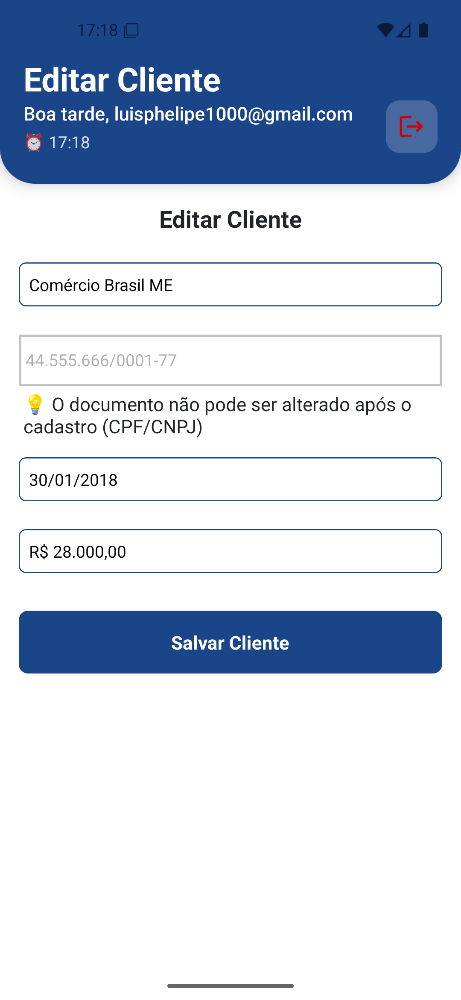

<div align="center">
  
  
  # 🏦 CDC Bank Mobile App
  
  <p>
    <strong>Aplicativo mobile desenvolvido em React Native + TypeScript para gerenciamento bancário , permitindo que parceiros gerenciem clientes e realizem transações entre contas de forma segura e eficiente</strong>
  </p>
  
  <p>
    
    
    
    
  </p>
  
  <p>
    <a href="#-features">Features</a> •
    <a href="#-screenshots">Screenshots</a> •
    <a href="#-tech-stack">Tech Stack</a> •
    <a href="#-getting-started">Getting Started</a> •
    <a href="#-license">License</a>
  </p>
</div>

## ✨ Features

### 🔐 **Autenticação**

- Tela de login com validação
- Persistência de sessão com AsyncStorage

### 👥 **Gerenciamento de Clientes**

- ✅ Listagem de clientes (Nome, CPF/CNPJ, Saldo)
- 🔍 Pesquisa em tempo real por Nome ou Documento
- ➕ Cadastro de novos clientes (PF/PJ)
- ✏️ Edição de dados dos clientes
- 🗑️ Exclusão de clientes
- 📊 Visualização de saldos e informações

### 💸 **Transferências**

- 🏦 Transferências entre contas
- 💰 Validação de saldo em tempo real
- 📝 Histórico de transações
- 🧾 Geração de comprovante PDF
- ✅ Confirmação de transferências

### 🎨 **Experiência do Usuário**

- 🎯 Interface intuitiva e responsiva
- ⚡ Loading states para feedback
- 🚫 Estados vazios (Empty States)
- 📱 Navegação fluida (Stack + Bottom Tabs)
- 🎨 Theme customizável

---

## 📷 Screenshots

<div align="center">
  <p><strong>🖼️ Capturas de tela do aplicativo</strong></p>
  
  
  
    
  
  
  
  <p><em>Da esquerda para direita: Login, Home, Editar Cliente ,Cadastro de Cliente, Transferências</em></p>
</div>

---

## 🛠️ Tech Stack / Decisoes Tecnicas

### **Core Technologies**

- ⚛️ [**React Native**](https://reactnative.dev/) - Framework mobile multiplataforma
- 📘 [**TypeScript**](https://www.typescriptlang.org/) - Superset JavaScript com tipagem estática
- 📱 [**Expo SDK 53**](https://expo.dev/) - Plataforma para desenvolvimento React Native

- (**React Native + Expo** é o framework recomendado pela equipe do React , multiplataforma , perfomatico com codigo nativo otimizado e traz mais velocidade do que desenvolvimento nativo ,ja aproveita que usa conceitos da react da web , javascript/ typescript , me traz ferramentas que ja agilizam meu desenvolvimento de apps como : Sdks prontas (Navigation com expo router , sqlite e async storage alem de deploys e atualizaçoes ota com Expo Updates.))

### **Navigation**

- 🧭 [**React Navigation v7**](https://reactnavigation.org/) - Stack + Bottom Tabs Navigation
- 📋 [**@shopify/flash-list**](https://shopify.github.io/flash-list/) - Lista performática e otimizada

- (Usei **React Navigation** porque traz um padrao mobile nativo(ios/android), uma configuraçao ainda mais simples , leve , otimo em manter alguns estados durante a navegaçao,bom de fazer manutençao por causa do roteamento declarativo.**Shopify/Flashlist** brilha os olhos quando assunto é performance em listas grandes,em testes se saiu melhor do que flatlist do React Native, menos uso de memoria , menos lag de scroll, em algumas situaçoes com muitos itens traz mais fps em tela o que é importante , para apps bancarios perfomance e segurança sao pontos muito importantes ate mesmo para produçao.Visando futuro flashlist ainda mais perfomance com suporte a nova arquitetura.)

### **Forms & Validation**

- 📝 [**React Hook Form**](https://react-hook-form.com/) - Gerenciamento de formulários
- ✅ [**Zod**](https://zod.dev/) - Schema validation TypeScript-first

- (Usei **React Hook Form** para usar nos components nao controlados e validar seus dados com zod , o objetivo era usar uma biblioteca leve com minimo de dependencias possivel, que trouxesse menos renders,uma validaçao client segura e com autocomplete , **zod** tem bundle leve chegando a uns 12kb por ai o que é muito bom para projeto final e que pode ir para produçao.Em ambiente real de produçao manteria as duas tecnologias pois app bancario precisaria de um controle de formularios eficiente, leve e seguro mantido pela comunidade) -[Link comparaçao React Hook Form vs Formik](https://refine.dev/blog/react-hook-form-vs-formik/#cons-of-formik)

### **State Management & Storage**

- 🔄 [**Context API**](https://react.dev/reference/react/useContext) - Gerenciamento de estado global
- 💾 [**AsyncStorage**](https://github.com/react-native-async-storage/async-storage) - Persistência local

-(**Async Storage** usa uma api muito familiar , 0 configuraçoes, traz um bundle size menor , uma boa performance se comparado ao seu concorrente MMkV , traz segurança mediana para dados criticos como tokens de autenticaçao mas usado com outra ferramenta como cripto-js.Para ambiente de produçao nao acho ele tao robusto e seguro.**Context Api** ultilizei context api porque se tratava de um projeto pequeno com poucas telas , sem grande quantidade de dados para gerenciar, crud todo feito em memoria e me entregaria uma boa performance e nem precisaria de mais dependencias externas,zero bundle size e alguns elementos react para otimizaçao.Para ambiente em produçao visando perfomance , padrao de mercado , comunidade , curva de aprendizado rapida para equipes pois traz uma otima documentaçao eu usaria Zustand 100% em todo o projeto e uma segunda opçao seria redux mas o boilerplate dele é maior e nao vejo que traz tanta agilidade assim(opniao pessoal))

### **Development Tools & Styles(UI) **

- 🔧 [**ESLint**](https://eslint.org/) - Linting e padronização de código
- 💅 [**Prettier**](https://prettier.io/) - Formatação automática de código
- 🧪 [**Jest**](https://jestjs.io/) + [**Testing Library**](https://testing-library.com/) - Testes unitários
- 🎨 [**StyleSheet + Theme**]() - Estilização nativa com sistema de temas customizado

-(ultilizei **Eslint** e **Prettier** para linting,formataçao automatica integrada ao (vs code) e padrao de codigo,configurei ambos com opçoes mais usadas em algumas empresas para desenvolvimento,codigo mais organizado visualmente,padrao automatica de equipe,aviso de regras como a de hooks, variaveis nao usadas,organizaçao de imports e de estilos.Eslint e Prettier sao faceis de usar com o Expo, e impacto pequeno no bundle da aplicaçao por padrao de mercado e vantagens de um padrao de codigo e regras eu produçao eu manteria os dois e usaria para complementar o husky para validaçao de commits semanticos.)

-(**Jest** e **Testing Library** foram escolhidos para criar uma suite de testes robusta focada no comportamento do usuário. **Jest** é o framework de testes padrão do React Native, vem configurado zero-setup com Expo,**Testing Library** traz queries semânticas (getByText, getByRole) e curva de aprendizado menor e mocks automáticos.Para ambiente de produção bancária, essa combinação é crítica - detecta bugs antes do deploy, validações de formulário funcionam corretamente, fluxos de transferência são seguros, e testes se componentes renderizam corretamente. Bundle size zero (dev-only))

-(**StyleSheet + Theme** o uso do Stylesheet para esse projeto se teve por causa de se tratar projeto pequeno, stylesheet traz perfomance nativa, se comparado a outra opçao que seria o styled-components, pois os estilos sao compilados nativamente no projeto bom para app bancario,sem dependencias css-in-js extras do styled-components,menor bundle size , uma renderizaçao mais proxima da bridge para no final gerar codigo nativo.Utilizei ainda um tema simples e customizado pegando como base as cores do site da Cdc Bank, beneficios de usar esse tema foi design consistente, facil de manutençao para grande escala , facil adiçao de novos tokens de cores e mudanças.Os dois combinados aumentou em +20 meu desenvolvimento em telas e components do app.Em produçao poderia usar outras opçoes como Unistyles e opçao que ja traz components usaria Raect Native Reusables baseado no nativewind e shacn/ui) -[Link comparaçao StyleSheet vs Styled-Components - Tailwind RN](https://medium.com/@vinny.higuchi/compara%C3%A7%C3%A3o-entre-stylesheet-styled-components-e-tailwind-no-react-native-7936128397f9)

## 🚀 Getting Started

### **Pré-requisitos**

- [**Node.js**](https://nodejs.org/) (versão 18+ recomendada)
- [**npm**](https://www.npmjs.com/) ou [**Yarn**](https://yarnpkg.com/)
- [**Expo CLI**](https://docs.expo.dev/get-started/installation/)

### **Instalação**

1. **Clone o repositório**

```bash
git clone https://github.com/PhelipeG/Cdc-Bank-ReactNative.git
cd Cdc-Bank-ReactNative
```

2. **Instale as dependências**

```bash
npm install
# ou
yarn install
```

3. **Execute o projeto**

```bash
npm start
# ou
expo start
```

4. **Execute os testes**

```bash
npm test
# ou
npm run test:coverage
```

### **Estrutura do Projeto**

### ** Decisoes de Arquitetura **

Decisao de arquitetura -> montei uma arquitetura que separa bem as responsabilidades , ultiliza bem hooks customizados para separar a logica da UI , facil de uma boa manutençao e teste para cada
componente, hook , telas , funçoes ultilitarias, contextos , serviços e modelos.Ela se baseia em uma arquitetura hibrida e limpa , onde separo tudo por features , responsabilidades unica em cada arquivo, bem particionada para melhor testabilidade e reutilizaçao como o exemplo de components e schemas de validaçao.Para app em produçao bancaria visa ser uma otima arquitetura pois traz uma boa separaçao de camadas e type safe em toda aplicaçao.

```
📦 src/
├── 📁 components/          # Componentes reutilizáveis
│   ├── 📁 features/        # Componentes específicos de funcionalidades
│   ├── 📁 layout/          # Componentes de layout
│   └── 📁 screens/         # Componentes específicos de telas
├── 📁 contexts/            # Contextos React (Auth, Client)
├── 📁 hooks/               # Custom hooks
├── 📁 models/              # Interfaces e tipos TypeScript
├── 📁 schemas/             # Schemas de validação Zod
├── 📁 screens/             # Telas principais
├── 📁 services/            # Serviços (storage, API)
├── 📁 theme/               # Sistema de temas e estilos
├── 📁 utils/               # Funções utilitárias
└── 📁 __tests__/           # Testes automatizados
```

---

## 🧪 Testing

O projeto inclui testes automatizados para garantir qualidade e confiabilidade:

- **Unit Tests** - Hooks e utilitários
- **Component Tests** - Componentes React
- **Integration Tests** - Fluxos principais

```bash
# Executar todos os testes
npm test

# Executar testes com coverage
npm run test:coverage

# Executar testes em modo watch
npm run test:watch
```

---

## 👨‍💻 Author

<div align="center">
  
  
  **Luis Felipe Guilhao Silva**
  
  [](https://www.linkedin.com/in/luis-felipe-silv)
  [](https://github.com/PhelipeG)
</div>
